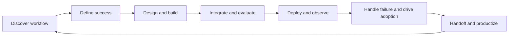

# FDE for Beginners

Learn Forward Deployed Engineering by solving realistic customer problems.

**Discovery -> Design -> Build -> Integrate -> Evaluate -> Deploy -> Operate -> Productize**

A practical field guide and, as v0.1 develops, a local lab environment and customer-engagement simulator. Start with a customer's workflow, build the smallest useful solution, and collect evidence that it works when dependencies fail.

Forward Deployed Engineers work close to customers and own technical delivery across system boundaries. That includes software, data, APIs, applied AI, reliability, security, and communication. AI is one possible component, not the definition of the role.

## Start here

Read [START_HERE](START_HERE.md), then [choose your path](docs/learning-paths/choose-your-path.md). The current foundation exercises require no paid services or API keys. Contributors can install the Python project and run its checks immediately.

## Who this is for

Beginner developers, software and data engineers, AI engineers, solutions architects, consultants, and senior engineers who want to practice delivery across technical and customer constraints. Use the [skills matrix](docs/learning-paths/skills-matrix.md) to choose evidence to produce, rather than treating every chapter as mandatory.

## What you will practice

- Observe a workflow and separate the requested solution from the underlying problem.
- Define technical, quality, workflow, adoption, and business success independently.
- Scope integrations, trust boundaries, failure behavior, and a useful vertical slice.
- Evaluate before rollout, preserve a fallback, and assign operational ownership.
- Explain tradeoffs to users and engineers, then turn repeated field problems into reusable components.

Every core guide has a concrete exercise. Keep your decisions, assumptions, and review evidence in a [progress tracker](docs/learning-paths/progress-tracker.md). No framework collection or job-market claims are needed.

## The delivery loop

The [lifecycle guide](docs/foundations/fde-lifecycle.md) makes each transition an evidence gate. Shipping a demo does not establish production readiness.

## v0.1 learning environment

| Experience | Outcome | Current status |
| --- | --- | --- |
| Reliable API Integration | Handle retries, validation, timeouts, and duplicate writes | Planned, Phase 2 |
| RAG and Evaluation | Retrieve synthetic policies and evaluate grounding and abstention | Planned, Phase 2 |
| MCP and Safe Tool Execution | Separate reads from code-enforced approved writes | Planned, Phase 2 |
| Northstar Support Copilot | Integrate customer, order, policy, and ticket workflows | Planned, Phase 3 |
| Atlas Logistics engagement | Work through ambiguity, delivery, and a surprise incident | Planned, Phase 3 |

These experiences are not implemented or labeled runnable yet. See the [roadmap and release gates](ROADMAP.md).

## Repository status

**Phase 1 foundation, pre-release (`0.1.0.dev1`).** Available now: six core guides, learning navigation, repository policies, a locked Python development environment, tests, CI configuration, and MkDocs documentation. v0.1.0 is not complete.

The Northstar Retail Support examples are fictional. Any exercise numbers are synthetic planning inputs, not measured customer outcomes. Atlas Logistics is reserved for the later simulation.

## Contributing and author

Read [CONTRIBUTING](CONTRIBUTING.md) for scope, checks, and repository setup recommendations. Contributions should improve a learner's implementation or judgment, not add page count. See the [code of conduct](CODE_OF_CONDUCT.md) and [security policy](SECURITY.md).

Created by **Ravi Kiran Pagidi**. Licensed under the [MIT license](LICENSE). First-party background sources and their limits are recorded in [References](docs/references.md).
