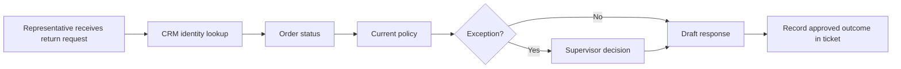

# Customer discovery

Northstar's support manager asks for "an AI agent to make returns faster." Treat that as a hypothesis about a solution. Your goal is to understand one real workflow, its costly or risky steps, and the constraints on changing it. All examples below are fictional; use synthetic records for exercises.

## Observe before proposing

Ask a representative to walk through a recent ordinary return and a difficult exception. With permission, observe the systems visited, fields copied, pauses, decisions, and handoffs. Do not collect private customer data for your learning notes. A sanitized screen description or synthetic replay is enough.

Separate what someone says from what you observe. "The policy search is slow" could mean the page loads slowly, the correct document is hard to find, or conflicting versions require a supervisor. Those problems need different interventions.

Use a short interview sequence: establish the outcome, replay a case, inspect an exception, confirm constraints, and play back what you learned. Leave time for the user to correct your interpretation. Avoid a long questionnaire that never follows an unexpected clue.

## Questions that change engineering decisions

| Investigate | Ask for evidence | Why it changes the design |
| --- | --- | --- |
| Workflow | "Show me what triggers the case and what marks it complete." | Establishes system boundaries and completion semantics |
| People | "Who does the work, owns the result, and absorbs mistakes?" | Separates user, sponsor, approver, and operator |
| Frequency | "How many eligible cases arrive, and when do peaks occur?" | Establishes workload and a denominator |
| Cost | "Which steps consume time or cause rework? How is that recorded?" | Tests value without inventing financial savings |
| Systems | "Which system is authoritative for each field?" | Prevents accidental synchronization conflicts |
| Data | "Which fields are absent, late, or inconsistent?" | Shapes validation and fallback behavior |
| Decisions | "Which rules are explicit, and which need judgment?" | Distinguishes deterministic checks from review or modeling |
| Permissions | "Who may read this record and who may change it?" | Defines authorization independently of login |
| Failure | "What happens if the order service is unavailable?" | Reveals recovery, manual work, and safety boundaries |
| Success | "What measured change would justify continuing?" | Defines an acceptance test with an owner |
| Adoption | "When would a representative bypass this tool?" | Reveals trust, training, and workflow fit |
| Constraints | "What latency, budget, network, retention, or review limits apply?" | Avoids a design that cannot be deployed |

For regulatory or contractual constraints, ask the responsible customer expert to validate requirements. Do not infer permission from the existence of an API or a sample export.

## Map one case

Along each arrow, record the input, output, responsible person, approximate waiting time if measured, and failure behavior. Label unknowns. A workflow map without decision authority or exception paths is incomplete.

## Exercise: run a discovery review

Use these synthetic interview notes:

- Manager: "We need automatic refunds by next month."
- Representative: "Finding the right policy takes longer than writing the reply."
- Order-system owner: "The API exists, but pilot access is read-only."
- Security reviewer: "Regional teams must not see each other's customer records."
- Supervisor: "Some exceptions depend on evidence outside the ticket."

Before reading further, produce eight prioritized follow-up questions, a workflow map, a stakeholder/decision-owner table, and a list of observed versus assumed facts. Pick the three unknowns that most affect whether any pilot is feasible. Preserve this discovery record for your portfolio.

Review guidance: strong questions ask how policy versions are selected, whether regional access can be enforced, who approves exceptions, and what read-only work is already useful. Asking "which LLM do you prefer?" does not resolve those uncertainties. The manager's requested date is a constraint to negotiate, not proof that refund automation is feasible.

## Reconcile conflicting accounts

Do not average stakeholder opinions. Replay the same synthetic case with a representative and a system owner. Record disagreement as an open question with an evidence request and owner. For example: "API freshness is unknown; order-system owner will provide update-delay examples before design review." If access remains unavailable, scope a synthetic prototype and state that integration feasibility is unverified.

Play back your findings in plain language: "We have evidence that policy selection is painful. We have not measured its contribution to handling time. The first investigation will compare policy lookup and exception waiting, while checking regional access."

## FDE Decision

When is discovery sufficient? Proceed when you can name the user, trigger, desired outcome, authoritative data, decision owner, baseline plan, constraints, and largest remaining risk. More interviews have diminishing value if they do not change the next experiment. Conversely, missing permission boundaries is a reason to stop live-data implementation, not a detail to fix later.

## Production Reality

A process can work because one experienced employee remembers undocumented exceptions. Automating the happy path may move all difficult cases onto that person. Measure exception and rework rates, preserve escalation, and involve that employee in acceptance review. Discovery continues after launch through failure and bypass evidence.

Next: turn your observations into [problem framing and success criteria](problem-framing.md).
