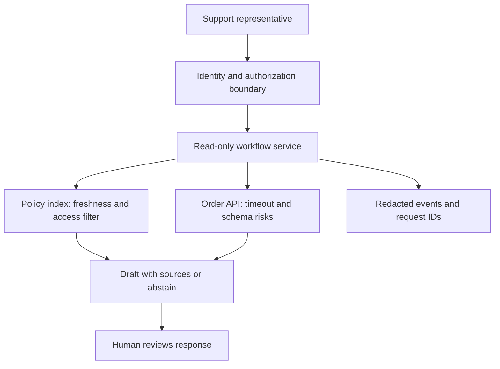

# Solution design and technical scoping

Start with the [problem statement](problem-framing.md), not a framework diagram. For Northstar, the first useful slice is a representative receiving authorized order facts and current policy evidence for a single return request. Automatic refunds are excluded. The design below is an exercise, not an implemented service.

## Design in a deliberate order

1. Restate the problem and trace today's workflow, including exceptions.
2. Record hard constraints and distinguish them from preferences.
3. Agree success criteria, guardrails, and the baseline collection plan.
4. Draw system boundaries and name the authority for each field.
5. Define integration contracts, access checks, and failure semantics.
6. Choose the smallest complete user path that can test value.
7. Compare architecture alternatives and record the decision.
8. Plan evaluation, rollout, support, rollback, and handoff before promising launch.

The smallest useful slice crosses the necessary layers. "Finish the database" is a component milestone; "show an authorized order and its applicable policy with unavailable-data handling" is a vertical slice a representative can assess.

## Proposed boundary diagram

The order system remains authoritative for order status. Policy owners remain responsible for version and applicability metadata. A draft cannot grant permission. If a model is introduced later, its input should include only authorized context and its output must remain subject to validation and review.

## Contracts before glue code

For each dependency, specify request fields, response schema, identity propagation, expected latency, timeout budget, rate limit, error categories, and version owner. Decide whether stale reads are acceptable and how freshness is displayed. For future writes, define idempotency keys, approval binding, audit events, and reconciliation after an uncertain timeout.

| Failure | User-visible behavior | Engineering response |
| --- | --- | --- |
| Order API times out | "Order information unavailable; use the existing workflow" | Bounded retry for safe operations within total deadline; record dependency error |
| Credentials expire | Clear unavailable state; no fabricated result | Stop repeated authentication attempts and alert credential owner |
| Schema changes | Do not infer missing eligibility fields | Reject incompatible response and preserve safe diagnostics |
| Policy is stale or irrelevant | No confident policy recommendation | Abstain, show the source limitation, and route to reviewer |
| Access check fails | Deny access without leaking record contents | Audit decision metadata, not sensitive payloads |
| Ticket write outcome is uncertain | Report pending reconciliation, not success | Check idempotency state before attempting another write |

Retry only failures that may succeed later, and only when repeating the operation is safe. More retries can exhaust a shared rate limit or amplify an outage. Reserve time for the fallback within the end-to-end latency budget.

## Example architecture decision

**Context:** representatives need current order facts, but the pilot has read-only access and no approved write credentials.

**Options:** a new replicated order database; direct bounded reads from the order API; a scheduled snapshot.

**Decision for the exercise:** start with direct reads and explicit unavailable states. This avoids owning a second source of truth. It depends on acceptable upstream latency and pilot rate limits, both still to be verified.

**Consequences:** the view cannot answer order questions during an upstream outage. A snapshot may become preferable if measured availability is insufficient and the customer accepts visible staleness. Revisit after collecting latency, outage, and freshness requirements, not simply because caching is fashionable.

Preserve context, alternatives, decision, consequences, and the trigger for revisiting it. That is more useful than an architecture diagram with no explanation.

## FDE Decision

Normal application code is appropriate for known deterministic steps. A REST API is useful when consumers need a stable network contract. A model tool can expose a narrow capability to a model; MCP can standardize tool access across compatible clients. An agent workflow adds value only when choosing and sequencing steps requires flexibility that you can evaluate and constrain. None of these removes authorization or the need to handle failure.

Do not turn every integration into an agent. Northstar's order lookup by ID is deterministic; drafting a readable summary may use a model; refund authority belongs to explicit business rules and authorized approval.

## Exercise: cut scope without losing value

Assume the policy corpus is available but order API access will arrive after the pilot review. Compare a synthetic prototype, a policy-only pilot, and waiting for the full integration. State what each can and cannot validate. Pick one and identify the evidence required before using it with real work.

Produce a two-page design with the boundary diagram, dependency contracts, three failure cases, excluded features, an evaluation plan, and an owner for each unresolved dependency. Review it with a peer acting as the order-system owner. Preserve the rejected option and why it was rejected.

## Production Reality

Design includes the person who rotates credentials, reviews policy changes, receives an alert, and disables the feature. If those owners are missing, the architecture is incomplete. Move to the [readiness review](production-reality.md) before treating the pilot as a service.
