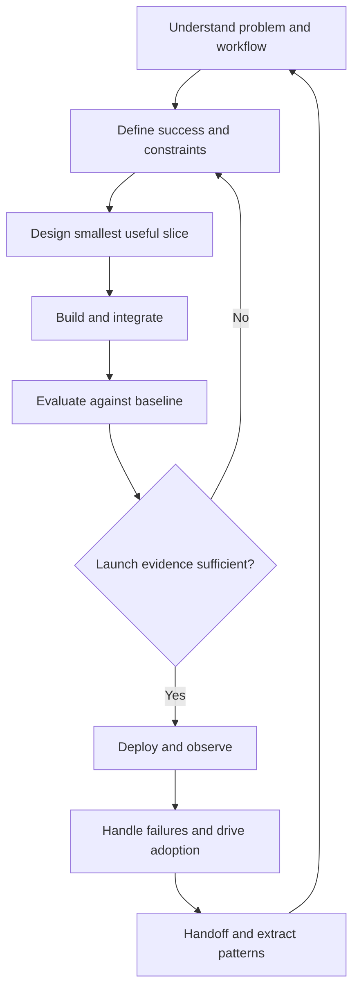

# The FDE lifecycle

Delivery is a loop of decisions backed by evidence. A phase ends when its key uncertainty is reduced enough to proceed, not when a meeting ends. For Northstar, the unit of work is a representative handling one return request across customer, order, policy, and ticket systems.

## Evidence at each transition

| Work | Question before proceeding | Evidence and accountable partner |
| --- | --- | --- |
| Understand the customer | Whose outcome is blocked? | Problem brief reviewed by sponsor and actual user |
| Discover workflow | What happens, including exceptions? | Observed workflow map and access inventory with operator |
| Define success | What baseline and guardrails determine value? | Metric definitions and acceptance owner |
| Design | What is the smallest useful complete path? | Boundaries, alternatives, and explicit exclusions with technical owner |
| Build and integrate | Do schemas, access rules, and failures behave as intended? | Contract tests and sanitized failure records with system owners |
| Evaluate | Which cases fail, and are they acceptable? | Versioned cases, results, and launch blockers with domain reviewer |
| Deploy | Can we stop safely and restore prior behavior? | Rollout and rollback rehearsal with operator |
| Observe and recover | Can someone diagnose a failed workflow? | Correlation IDs, alert routing, recovery procedure, incident evidence |
| Drive adoption | Do eligible users choose and trust it? | Usage denominator, feedback, and bypass reasons with team lead |
| Handoff | Can someone else operate and change it? | Runbook exercise and ownership acknowledgment |
| Productize | What repeats beyond this customer? | Reuse proposal with constraints, consumers, and maintenance owner |

An approval in one row does not replace another. Sponsor enthusiasm is not authorization to access restricted data. A passing evaluation is not evidence that rollback works.

## Worked checkpoint: the prototype looks good

Suppose a Northstar prototype drafts a correct response for five prepared examples. The sponsor requests launch next week. You still lack representative access rules, a policy freshness check, and a way to distinguish "no order exists" from "order service unavailable."

Continue a bounded prototype, but block use with live customer decisions until those gaps are resolved. Request a small set of representative cases and an operator review. Document the missing evidence, owner, and next review date. This is a delivery decision with a path forward, not a vague demand to "make it production ready."

## Exercise: make the handoffs explicit

Draw Northstar's delivery loop and place one artifact at each transition. Mark each artifact as observed, assumed, or not yet available. Then introduce a changed order schema after deployment. Identify which evaluation, contract, dashboard, runbook, and stakeholder update must change.

Preserve the annotated loop and a short change record. Review it by asking another engineer to locate the system owner and stop condition without asking you. If they cannot, improve the artifact rather than adding another meeting.

## Production Reality

Demo, proof of concept, pilot, production, and scaled production have different evidence needs. A pilot can deliberately cover fewer users or workflows, but it still needs access control, support, and a fallback. Scope can shrink; accountability cannot disappear. See [production readiness](../field/production-reality.md).

## FDE Decision

When should an engagement finish? Agree on an outcome, acceptance evidence, handoff owner, and bounded follow-up period before rollout. Unresolved defects need explicit ownership. Repeated integration problems may justify a shared library; an isolated Northstar business exception may belong in local configuration. Extract the reusable pattern without extending the engagement indefinitely.
