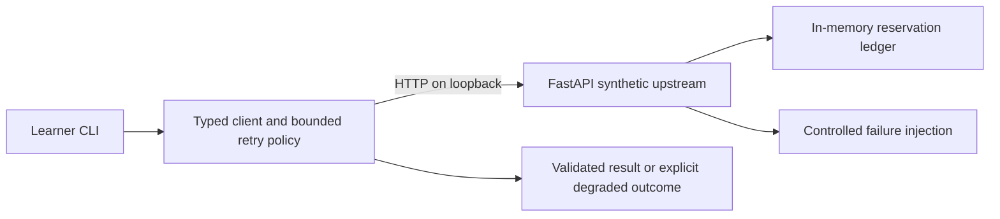

# Lab 1: Reliable API Integration

Status: **Runnable**. All records belong to fictional Northstar Retail.

## Customer scenario

Northstar needs to look up an order and reserve an item without replacing its internal API. The dependency occasionally rate-limits requests, times out, or loses a response after accepting a reservation. The existing manual workflow remains available when the integration cannot establish a safe result.

## Why this matters to an FDE

The customer owns the upstream system. Your job is to preserve useful work while defining failure behavior, retry budgets, and duplicate-write semantics. A successful request is only the first test.

## Learning objectives

Classify retryable failures; configure timeouts; validate responses; respect a rate limit; preserve a stable idempotency key; explain a degraded result without claiming the order is missing. Prerequisites: [setup](../../START_HERE.md), basic HTTP, JSON, and Python exceptions.

## Architecture



The API is a separate process. Tests mostly use FastAPI's local test transport; a real loopback test proves timeout behavior because the test transport does not enforce socket timeouts.

## Setup

Run every command from the repository root:

```sh
uv sync --locked --extra dev
```

Use `python -m uv` if uv is not on PATH. No credentials, Docker, cloud service, or external runtime connection is needed.

## Run locally

Terminal 1:

```sh
uv run --offline uvicorn fde_beginners.integration.upstream:app --host 127.0.0.1 --port 8001
```

Terminal 2:

```sh
uv run --offline fde-api
uv run --offline fde-api --reserve --mode duplicate_request --key demo-1
uv run --offline fde-api --reserve --key demo-1
```

The read returns order `O100`, customer `C001`, status `shipped`, and quantity `2`. Both writes return reservation `R001` on a fresh server. The first write deliberately receives a 503 after committing, retries, and recovers the existing result. It does not reserve twice.

**Reset:** stop Terminal 1 with Ctrl+C and restart the command. The in-memory ledger is intentionally lost. Use one worker only. Changing the key represents a new logical operation.

## Implementation walkthrough

Read `src/fde_beginners/integration/upstream.py`, then `client.py`, then the shared `reliability/retry.py`. Predict which errors reach the retry loop before running tests.

The client permits three attempts. HTTPX applies a 0.15-second timeout to each transport phase. Exponential sleeps start at 0.05 and 0.1 seconds. A valid Retry-After sets a minimum wait; a value above the one-second local waiting budget stops retries instead of retrying early. There is no hard end-to-end deadline in this lab.

Only transport timeouts/network errors and 429, 500, 502, 503, and 504 responses are retried. Validation errors and other HTTP errors stop immediately. The request model rejects nonpositive quantities. A repeated key with different input produces 409. A lock protects the local ledger's check-and-create operation.

Exercise: first predict the effects of changing the key on each retry. Then implement that incorrect change on your own branch and watch the idempotency test expose duplicate effects. Restore the correct behavior. Record the difference between retrying a read and retrying an uncertain write.

## Tests

```sh
uv run --offline pytest tests/test_integration.py -q
```

Tests cover success, timeout recovery, exhaustion, 429 backoff, malformed responses, validation, duplicate effects, and conflicting payloads. Sleep is injected in unit tests. A short real-server test exercises the HTTP transport. A Starlette warning about timeout arguments in TestClient is expected; timeout assertions use the real transport or explicit timeout exceptions, not TestClient timing.

## Failure injection

Each command below is run against the local server above:

| Command suffix after `fde-api` | Expected behavior |
| --- | --- |
| `--mode normal` | Success without retry |
| `--mode timeout` | First response delayed 0.5 seconds; client times out then recovers |
| `--mode rate_limit` | One 429, bounded wait, then success |
| `--mode server_error` | One 500, then success |
| `--mode server_error --failures 10` | Three attempts, degraded JSON with `http_500`, exit 2 |
| `--mode malformed_response` | Invalid schema, no retry, `invalid_response`, exit 2 |
| `--reserve --mode duplicate_request --key demo-2` | Commit, lost response, retry, one reservation |

The test-only `X-Attempt` header makes injection deterministic. A production service must never trust such a caller-controlled header as evidence of authorization or delivery.

If connection fails, check that Terminal 1 is running on port 8001 and that no other app occupies the port. Do not interpret an unavailable service as an empty order. Exit 2 is the intended degraded path, not a successful operation.

## Production Reality

The ledger is neither durable nor distributed. Restarting removes deduplication history, and multiple workers would have separate ledgers. Production requires an atomic durable store, retention and key-scope rules, a total deadline, jitter to avoid retry storms, capacity testing, service-level objectives, and centralized tracing. HTTPX's phase timeouts do not bound a slow trickle response indefinitely. The lab's logs contain operational metadata, not payloads.

## FDE Decision

Should we retry, fail immediately, or degrade? Retry only when the failure is transient, the operation is repeat-safe, and a useful response can still arrive within the workflow budget. Reject malformed data immediately. Degrade to the existing workflow after exhaustion. A write with an unknown outcome needs reconciliation using the same logical key, not a new blind submission.

## Stretch challenge

Add a total deadline and a durable SQLite ledger. Prove that two concurrent requests and a service restart still yield one logical reservation. Compare that guarantee with the current single-process version; do not simply add more retries.

## Portfolio artifact

Keep failure-mode test output, the architecture, and a [reliability ADR](../../templates/architecture-decision-record.md). Explain why a malformed response is not retried and what you would change before production. Continue to [RAG and Evaluation](../02-rag-and-evaluation/README.md).
