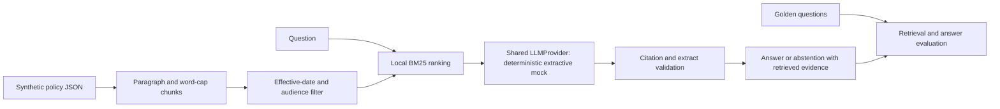

# Lab 2: RAG and Evaluation

Status: **Runnable**. Policies and questions are synthetic.

## Customer scenario

Northstar representatives search return, damage, shipping, and warranty policies. A fast answer is not useful if it cites the wrong audience's policy or an expired version. Build and inspect the retrieval pipeline before deciding whether to add infrastructure.

## Why this matters to an FDE

You must explain whether a bad answer came from missing evidence, wrong evidence, or misuse of the evidence. An appealing answer is not an evaluation result.

## Learning objectives

Ingest metadata; chunk text; rank locally; inspect scores and sources; validate extractive citations; measure Recall@k and MRR; distinguish unsupported questions from retrieval misses. Prerequisites: [setup](../../START_HERE.md) and basic Python/JSON. Lab 1 is helpful but not required.

## Architecture



## Setup

From the repository root:

```sh
uv sync --locked --extra dev
```

No model downloads, API keys, or external connections are used. The default paths point to this lab's `corpus.json` and `golden.json`; run from the root so they resolve. The corpus has ten documents, including an expired policy and a not-yet-effective holiday policy. Fourteen golden cases cover direct answers, ambiguity, metadata, unsupported input, and a deliberate vocabulary mismatch.

## Run locally

```sh
uv run --offline fde-rag ask --query "What is the return window with a receipt?"
uv run --offline fde-rag evaluate
uv run --offline fde-rag evaluate --report .fde-lab/rag-evaluation.json
```

The ordinary answer states `30 days`, cites `returns-current`, and includes chunk IDs, scores, dates, and audiences. Evaluation prints a concise summary to stdout; diagnostics go to stderr. `--report` also saves full per-case context, answers, and checks to the specified JSON file.

Validated baseline: 14 questions, 12 retrieval cases, Recall@1 = 0.8750, Recall@3 = 0.9167, MRR@3 = 0.9167, abstention checks = 13/14, fact checks = 13/14. These are computed synthetic results, not production claims or hard-coded CLI output.

The checked-in defaults use a fixed as-of date of 2026-10-01 for reproducibility, not the machine's current date. This is a learning fixture, not a live policy service.

**Reset:** there is no mutable index or cache. Rerun either command. Revert personal corpus edits to restore the baseline.

## Implementation walkthrough

Follow `src/fde_beginners/rag/retrieval.py` -> `workflow.py` -> `evaluation.py`. Application code accepts the shared `LLMProvider` protocol. `FDE_LLM_PROVIDER` defaults to `mock`; an unknown name fails explicitly. No real-provider adapter is included.

Chunking keeps paragraph boundaries, then splits paragraphs above 60 words without overlap. Every chunk retains source ID, audience, title, topic, and effective/expiry dates. A small chunk can detach a rule from its exception; a large chunk can mix topics. Try `--chunk-words 4` and inspect how incomplete sentences affect citation checking. This is one baseline with a size experiment, not a chunking framework.

BM25 uses token frequencies and inverse document frequency, with deterministic tie ordering. It performs no synonym expansion or semantic embedding. Scores are ranking signals, not probabilities. Filtering precedes ranking in normal mode. Results expose top-k chunks; evaluation deduplicates ranked chunks to document IDs before computing document metrics.

The mock selects a sentence with at least two distinct non-stopword query terms in common. It returns that sentence and its source, or abstains. It ignores system instructions as executable commands. The `extractive` indicator means copied evidence, not calibrated confidence or proven correctness. Audience conflicts among retrieved policies trigger abstention.

The citation validator requires cited sources to have been retrieved and the extract to occur in cited text. This catches fabricated citations and unsupported extracts, but cannot establish that the sentence answers the question or that a bypassed stale policy is appropriate.

## Tests

```sh
uv run --offline pytest tests/test_ai.py tests/test_rag.py -q
```

The tests check deterministic providers/retrieval, invalid configuration, metadata, top-k, metric arithmetic, abstention, source membership, unsupported generated text, and all injection modes. They intentionally preserve a known retrieval miss; passing software tests does not mean perfect answer quality.

## Failure injection

Run `uv run --offline fde-rag ask --query "return window receipt"` with one suffix:

| Suffix | What to inspect |
| --- | --- |
| `--failure drop_relevant` | Current returns document removed; distinguish wrong context from bad generation |
| `--failure stale_first` | Expired 90-day policy injected ahead of current evidence |
| `--failure wrong_policy` | Ranking query intentionally changed to exchanges |
| `--failure no_context` | Empty context must abstain without citations |
| `--failure ignore_metadata` | Date/audience filter bypassed; inspect inappropriate sources |
| `--audience all` | Conflicting business/retail return windows should abstain |

Separately ask `"How long can I send my purchase back?"`. It should miss the relevant policy because the baseline lacks synonym matching. The golden case expects an answer, so this is a visible failure, not relabeled as a correct abstention. A test provider with a fabricated source demonstrates a generation failure in `tests/test_rag.py`.

If every query abstains, inspect tokens and corpus path before changing providers. If a cited answer is wrong, inspect source metadata and rank before changing the prompt.

### Reading the report

Recall@k is the fraction of expected relevant documents present in the first k unique ranked documents, macro-averaged over cases with expected documents. Unsupported cases have no retrieval target and are excluded from that denominator. MRR@3 averages the reciprocal rank of the first relevant document, or zero for a miss within three. The implementation ranks up to 20 chunks, sufficient for this corpus, before deduplication.

Abstention checks cover all 14 cases: did the actual abstention decision match the label? Fact checks are simple case-insensitive substring checks, plus correct abstention for unsupported cases. They are reproducible diagnostic checks, not semantic evaluation. The per-case context is included separately from document ranking so chunk effects remain visible.

Exercise: produce a report, diagnose the vocabulary mismatch, then add a synonym rule or revise the corpus on your own branch. Re-evaluate the entire dataset. Explain any regression instead of optimizing only the failing question. Do not silently change golden labels to match output.

## Production Reality

There are no document ACLs, semantic embeddings, live ingestion, index freshness service, or model-quality guarantee. Production needs authorization before retrieval, governed policy versions, representative held-out evaluation, injection resistance, human review, and monitoring for corpus and embedding drift. Keeping an archived policy for audit is different from making it eligible to answer a current question.

## FDE Decision

Do we need embeddings or a vector database? First measure missed vocabulary, corpus size, update volume, latency, and access-control requirements. A lexical baseline may suffice for a small governed corpus. Embeddings could improve paraphrase recall but require a new evaluation and indexing plan. Conflicting valid policies require clarification, not confidence averaging. Filter stale sources for current answers and retain them separately for audit when policy requires it.

## Stretch challenge

Add a held-out paraphrase set and evaluate before and after a small retrieval change. Add conflict detection for two current policies within the same audience; the current rule only detects cross-audience conflicts.

## Portfolio artifact

Keep the evaluation report, one retrieval-failure analysis, and an [evaluation plan](../../templates/evaluation-plan.md). Explain denominators and the difference between passing software tests and acceptable workflow quality. Continue to [safe MCP tools](../03-mcp-safe-tools/README.md).
