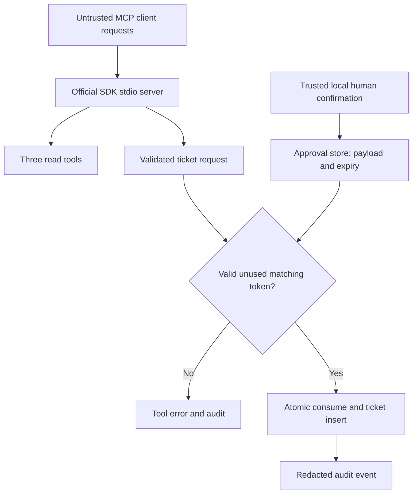

# Lab 3: MCP and Safe Tool Execution

Status: **Runnable**. This lab uses the official MCP Python SDK v2, locked to 2.2.0.

## Customer scenario

Northstar wants compatible AI clients to look up support context and create a ticket. Reading a synthetic order is different from creating a record someone must handle. The write must be approved explicitly even if a client sends a convincing explanation.

## Why this matters to an FDE

Tool exposure creates an action boundary. You must define who can approve, what exactly was approved, whether approval can be replayed, and what evidence remains after failure. Tool descriptions alone do not enforce those rules.

## Learning objectives

Run an actual MCP server/client exchange; separate read and write capabilities; validate input; reject missing and invalid approvals; bind approval to an action; inspect redacted audit events. Prerequisites: [setup](../../START_HERE.md). Familiarity with Lab 2 helps explain policy search but is not required.

## Architecture



The human operator path is separate from the MCP tools. The server exposes no tool for issuing approvals.

## Setup

From the repository root:

```sh
uv sync --locked --extra dev
```

The official v2 `MCPServer` and `Client` APIs were checked against [official references](../../docs/references.md). Plain `mcp` is sufficient; no Node-based inspector, external AI host, API key, or browser is needed.

## Run locally

```sh
uv run --offline fde-mcp-demo
```

This client launches a real stdio server, lists four tools, performs a read, and attempts an unapproved write. It then displays the exact proposed synthetic ticket and asks you to type `APPROVE`. Any other input declines. After approval, it creates `T001` and proves reuse of the same token is rejected.

Expected sequence:

```text
Read without approval: allowed
Write without approval: rejected
Proposed ticket: {"customer_id":"C001","summary":"Review damaged item evidence"}
Type APPROVE to create this synthetic ticket:
Write with approval: {"ticket_id": "T001", "status": "created"}
Reused approval: rejected
```

Audit JSON appears on stderr. Never print diagnostic text on the server's stdout because stdout carries the protocol.

For a standalone stdio server:

```sh
uv run --offline fde-mcp --db .fde-lab/tickets.db
```

It waits for an MCP client; it is not an interactive shell. Ctrl+C stops it. The demo handles server lifecycle for you and uses its own temporary database.

**Reset:** each demo run creates and removes a fresh temporary database. For standalone experiments, stop the server and choose a new database path. `.fde-lab/` is ignored by Git.

## Implementation walkthrough

Inspect `safe_tools/server.py`, `approval.py`, and `demo.py` under `src/fde_beginners/`.

| Tool | Operation | Approval | Failure examples |
| --- | --- | --- | --- |
| search_customer | READ | Not required | Empty query or missing customer |
| lookup_order | READ | Not required | Missing order |
| search_policy | READ | Not required | Invalid query; no matching sources returns an empty list |
| create_support_ticket | WRITE | Required | Invalid input, unknown customer, absent/invalid/expired/consumed token, downstream failure |

The trusted operator creates a random token only after explicit confirmation. SQLite stores its hash, exact normalized ticket payload, five-minute expiry, and consumed state. A transaction checks and consumes approval while inserting the ticket. Concurrent calls cannot use one token to create two effects. Changed payloads and expired or consumed tokens fail closed. An injected downstream failure rolls back both steps.

Tool input is validated by the SDK and the ticket's Pydantic model. Expected errors become MCP tool errors, never success-shaped messages. Standard logging records tool name, READ/WRITE, request ID, approval status, outcome category, and UTC timestamp without the token, name, or summary. SDK-level schema rejection occurs before the application audit wrapper; complete protocol rejection auditing is outside this lab.

Exercise: list tools and confirm there is no approval-granting tool. Try to use one approval for a different summary. Explain why the business payload is bound to approval, while a caller's persuasive prompt is not authority.

## Tests

```sh
uv run --offline pytest tests/test_safe_tools.py -q
```

Tests use the official in-process client and one stdio subprocess exchange. They prove reads succeed; missing/invalid approvals fail; valid approval creates a ticket; changed, expired, or replayed approvals fail; concurrent consumption creates one effect; and downstream failure creates none. Tests explicitly issue approvals through the trusted operator store, representing the human decision without requiring CI keyboard input.

## Failure injection

Run the downstream-failure test above, or start a standalone server with `--fail-writes`. The failure is configured by the operator at startup, not by model-provided tool arguments. The response is an error and the approval remains usable because the local transaction made no change.

If the demo cannot import its server, rerun locked sync and launch from the repository root. If policy search cannot find the corpus, check the working directory. A reused token is intentionally rejected, not a broken retry. Do not remove the gate to make a write succeed.

## Production Reality

This is a single trusted local operator exercise, not enterprise IAM. Any process with write access to the SQLite file can bypass its controls. Do not grant untrusted clients filesystem access, expose the database, or publish this server as a service. There is no user identity, tenant isolation, authorization scope, signed audit log, or tamper protection.

Human approval does not replace authorization. Production needs an independent approver identity, scoped permissions, protected approval storage, durable audit records, expiry policy, and distributed enforcement. A real remote ticket API cannot participate in the same SQLite transaction: uncertain writes need idempotency and reconciliation, connecting this lab to Lab 1.

## FDE Decision

| Mechanism | Use when | Decision boundary |
| --- | --- | --- |
| Python function | One application owns a known operation | Simplest contract and test surface |
| REST API | Multiple consumers need a network service | Define identity, authorization, and versioning |
| Deterministic workflow | Steps and branching rules are known | Prefer explicit control for predictable operations |
| LLM tool | A model needs a narrow capability | Constrain arguments and action authority |
| MCP tool | Several compatible AI clients should share a capability | Standardize exposure; reuse the underlying business logic |
| Agent workflow | Flexible step selection adds measurable value | Evaluate sequence failures and bound autonomy |

If an existing API already solves the integration, MCP may be an adapter rather than a replacement. A model need not choose when to call a deterministic lookup. Mutating capabilities always need an explicit authority decision, regardless of transport.

## Stretch challenge

Design, but do not pretend to implement, approval tied to two distinct real identities. Identify storage permissions, revocation, audit integrity, and the behavior after a network timeout. Compare those requirements with this local operator boundary.

## Portfolio artifact

Keep a permission matrix, approval-flow diagram, redacted denial/success audit evidence, and a [production-readiness checklist](../../templates/production-readiness-checklist.md). Explain the OS trust assumption clearly. The integrated project remains [deferred to Phase 3](../../ROADMAP.md).
